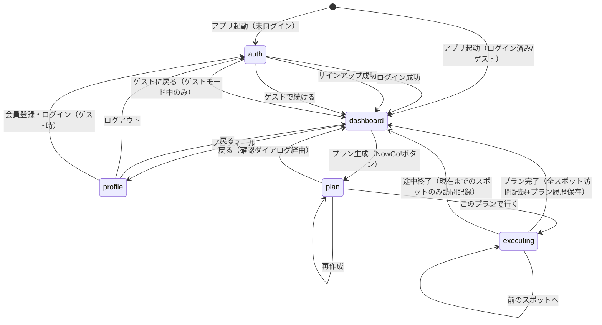

# NowGo 画面遷移図

## 1. 画面一覧

| # | 画面名 | screen値 | コンポーネント | 概要 |
|---|--------|----------|----------------|------|
| 1 | 認証画面 | `auth` | AuthScreen | ログイン・サインアップ・ゲスト入場 |
| 2 | ダッシュボード | `dashboard` | DashboardScreen | メインのプラン作成画面 |
| 3 | クイックプラン | `quickplan` | QuickPlanScreen | 簡易版プラン作成（レガシー・現在到達不能） |
| 4 | テーマ選択 | `themes` | ThemesScreen | テーマ別プラン作成（レガシー・現在到達不能） |
| 5 | プロフィール | `profile` | ProfileScreen | ユーザー情報・設定 |
| 6 | プラン確認 | `plan` | PlanScreen | 生成されたプランの確認・再作成 |
| 7 | プラン実行 | `executing` | ExecutionScreen | リアルタイムのプラン実行 |

※ `complete` 画面は廃止済み（完了処理はExecutionScreen内で行いdashboardへ遷移）

---

## 2. 画面遷移図（Mermaid）



---

## 3. 遷移詳細

### 3.1 認証画面
| トリガー | 条件 | 遷移先 |
|----------|------|--------|
| ログインボタン | メール・パスワード認証成功 | dashboard |
| サインアップボタン | アカウント作成成功 | dashboard |
| ゲストで続けるボタン | なし | dashboard |
| ゲストに戻るボタン | ゲストモード中のみ表示 | dashboard |

### 3.2 ダッシュボード → 各画面
| トリガー | 条件 | 遷移先 |
|----------|------|--------|
| NowGo!ボタン | 出発地が設定済み | plan（プラン生成後） |
| プロフィールアイコン | なし | profile |

### 3.3 プラン確認画面
| トリガー | 条件 | 遷移先 |
|----------|------|--------|
| このプランで行くボタン | なし | executing |
| 再作成ボタン | なし | plan（新プラン生成） |
| 戻るボタン（←） | 確認ダイアログで「戻る」を選択 | dashboard |

### 3.4 プラン実行画面
| トリガー | 条件 | 遷移先 |
|----------|------|--------|
| 次のスポットへボタン | 次のスポットが存在 | executing（次スポット表示） |
| 前のスポットへボタン（＜） | currentSpotIndex > 0 | executing（前スポット表示） |
| プランを完了するボタン | 最後のスポット + 確認ダイアログ | dashboard（全スポット訪問記録 + プラン履歴保存） |
| 終了するボタン | 確認ダイアログで「終了する」 | dashboard（現在までのスポットのみ訪問記録） |
| 戻るボタン（←） | 確認ダイアログで「終了する」 | dashboard（途中終了扱い） |
| スポットへ行くボタン | なし | 外部: Google Maps（別タブ） |

### 3.5 プロフィール画面
| トリガー | 条件 | 遷移先 |
|----------|------|--------|
| 戻るボタン | なし | dashboard |
| ログアウト | 確認ダイアログで「ログアウト」 | auth |
| 会員登録・ログイン（ゲスト時） | なし | auth |

### 3.6 プロフィール画面 メニュー項目の状態

| メニュー項目 | 状態 | 備考 |
|-------------|------|------|
| お気に入りスポット | 準備中（非活性） | カウント表示のみ |
| 行ったスポット | 準備中（非活性） | カウント表示のみ |
| プラン履歴 | 準備中（非活性） | カウント表示のみ |
| 設定 | 活性 | 設定画面を表示 |
| ヘルプ | 準備中（非活性） | - |
| プライバシーポリシー | 準備中（非活性） | - |

---

## 4. 画面遷移のルーティング方式

- **SPA方式**: Next.js App Routerの単一ページ（`app/page.tsx`）内でZustandの`currentScreen`値に応じてコンポーネントを切り替え
- **URLは変化しない**: すべて同一URLで画面切り替え（ブラウザ履歴なし）
- **初期画面判定**: `AuthProvider`の認証状態に基づき、ログイン済み→dashboard、未ログイン→auth

```
app/page.tsx のルーティングロジック:

  if (loading) → ローディング表示
  if (!user && !isGuest) → AuthScreen
  switch (currentScreen):
    'dashboard'  → DashboardScreen
    'quickplan'  → QuickPlanScreen
    'themes'     → ThemesScreen
    'profile'    → ProfileScreen
    'plan'       → PlanScreen
    'executing'  → ExecutionScreen
    default      → DashboardScreen
```
