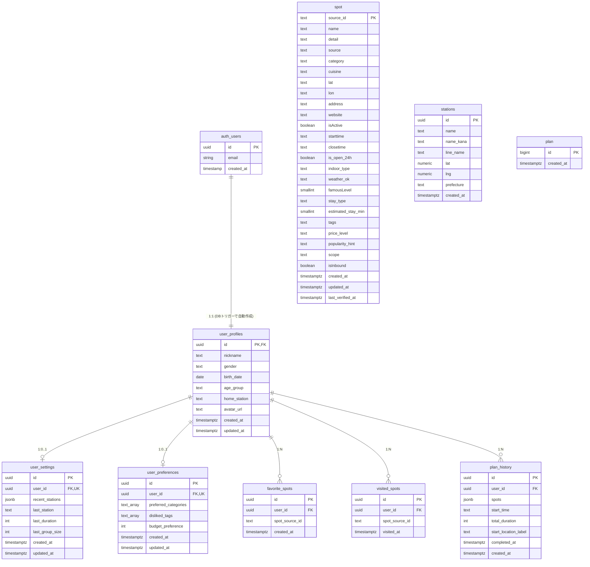

# NowGo ER図（データベース設計）

## 1. ER図（Mermaid）



---

## 2. テーブル詳細

### 2.1 user_profiles（ユーザープロフィール）

auth.usersと1:1対応。サインアップ時にDBトリガー`handle_new_user`で自動作成される。

| カラム名 | 型 | NULL | デフォルト | 説明 |
|----------|-----|------|-----------|------|
| id | uuid | NO | - | PK, auth.users.id への FK |
| nickname | text | NO | - | 表示名 |
| gender | text | YES | - | 性別 |
| birth_date | date | YES | - | 生年月日 |
| age_group | text | YES | - | 年代（未使用） |
| home_station | text | YES | - | 最寄り駅（未使用） |
| avatar_url | text | YES | - | アバター画像URL（未使用） |
| created_at | timestamptz | YES | now() | 作成日時 |
| updated_at | timestamptz | YES | now() | 更新日時 |

**RLS**: 有効（自分のレコードのみ読み書き可能）

---

### 2.2 user_settings（ユーザー設定）

検索条件の永続化。ユーザーごとに1レコード。

| カラム名 | 型 | NULL | デフォルト | 説明 |
|----------|-----|------|-----------|------|
| id | uuid | NO | gen_random_uuid() | PK |
| user_id | uuid | NO | - | FK → user_profiles.id, UNIQUE |
| recent_stations | jsonb | YES | '[]' | 直近の検索駅リスト（最大5件） |
| last_station | text | YES | - | 前回の出発駅 |
| last_duration | int | YES | 60 | 前回の検索時間（分） |
| last_group_size | int | YES | 1 | 前回の人数 |
| created_at | timestamptz | YES | now() | 作成日時 |
| updated_at | timestamptz | YES | now() | 更新日時 |

**recent_stationsの構造**:
```json
[
  { "name": "渋谷", "timestamp": 1709888400000 },
  { "name": "新宿", "timestamp": 1709802000000 }
]
```

**RLS**: 有効

---

### 2.3 user_preferences（ユーザー好み設定）

将来のパーソナライズ用。現時点では未使用。

| カラム名 | 型 | NULL | デフォルト | 説明 |
|----------|-----|------|-----------|------|
| id | uuid | NO | gen_random_uuid() | PK |
| user_id | uuid | NO | - | FK → user_profiles.id, UNIQUE |
| preferred_categories | text[] | YES | '{}' | 好みのカテゴリ |
| disliked_tags | text[] | YES | '{}' | 苦手なタグ |
| budget_preference | int | YES | 5000 | 予算目安（円） |
| created_at | timestamptz | YES | now() | 作成日時 |
| updated_at | timestamptz | YES | now() | 更新日時 |

**RLS**: 有効

---

### 2.4 spot（スポットマスタ）

お出かけ先のマスタデータ。約5,000件。

| カラム名 | 型 | NULL | デフォルト | 説明 |
|----------|-----|------|-----------|------|
| source_id | text | NO | - | PK（例: local:tokyo_289） |
| name | text | YES | - | スポット名 |
| detail | text | YES | - | 説明文 |
| source | text | YES | - | データ取得元 |
| category | text | YES | - | カテゴリ（cafe, museum, park 等） |
| cuisine | text | YES | - | 飲食ジャンル |
| lat | text | YES | - | 緯度（文字列格納） |
| lon | text | YES | - | 経度（文字列格納） |
| address | text | YES | - | 住所 |
| website | text | YES | - | Webサイト URL |
| isActive | boolean | YES | false | 有効フラグ |
| starttime | text | YES | - | 営業開始時刻（HH:MM） |
| closetime | text | YES | - | 営業終了時刻（HH:MM） |
| is_open_24h | boolean | YES | - | 24時間営業フラグ |
| indoor_type | text | YES | - | indoor / outdoor / both |
| weather_ok | text | YES | - | 天候条件（例: 雨OK） |
| famousLevel | smallint | YES | - | 知名度 1〜5 |
| stay_type | text | YES | - | stay / roam / short |
| estimated_stay_min | smallint | YES | - | 推定滞在時間（分） |
| tags | text | YES | - | タグ（カンマ区切り） |
| price_level | text | YES | - | free / low / medium / high |
| popularity_hint | text | YES | - | 人気度ヒント |
| scope | text | YES | - | big / medium / small |
| isInbound | boolean | YES | - | インバウンド向けフラグ |
| created_at | timestamptz | NO | now() | 作成日時 |
| updated_at | timestamptz | YES | - | 更新日時 |
| last_verified_at | timestamptz | YES | - | 最終確認日時 |

**RLS**: 有効
**データ件数**: small=4,635 / big=293 / medium=66

---

### 2.5 stations（駅マスタ）

駅名検索のオートコンプリート用。東京都の主要50駅。

| カラム名 | 型 | NULL | デフォルト | 説明 |
|----------|-----|------|-----------|------|
| id | uuid | NO | gen_random_uuid() | PK |
| name | text | NO | - | 駅名 |
| name_kana | text | YES | - | 駅名かな |
| line_name | text | YES | - | 路線名 |
| lat | numeric | NO | - | 緯度 |
| lng | numeric | NO | - | 経度 |
| prefecture | text | YES | '東京都' | 都道府県 |
| created_at | timestamptz | NO | now() | 作成日時 |

**RLS**: 有効

---

### 2.6 favorite_spots（お気に入り）

| カラム名 | 型 | NULL | デフォルト | 説明 |
|----------|-----|------|-----------|------|
| id | uuid | NO | gen_random_uuid() | PK |
| user_id | uuid | NO | - | FK → user_profiles.id |
| spot_source_id | text | NO | - | スポットID（spot.source_id） |
| created_at | timestamptz | NO | now() | 登録日時 |

**RLS**: 有効

---

### 2.7 visited_spots（訪問履歴）

| カラム名 | 型 | NULL | デフォルト | 説明 |
|----------|-----|------|-----------|------|
| id | uuid | NO | gen_random_uuid() | PK |
| user_id | uuid | NO | - | FK → user_profiles.id |
| spot_source_id | text | NO | - | スポットID（spot.source_id） |
| visited_at | timestamptz | NO | now() | 訪問日時 |

**RLS**: 有効

---

### 2.8 plan_history（プラン履歴）

| カラム名 | 型 | NULL | デフォルト | 説明 |
|----------|-----|------|-----------|------|
| id | uuid | NO | gen_random_uuid() | PK |
| user_id | uuid | NO | - | FK → user_profiles.id |
| spots | jsonb | NO | - | プランのスポット配列（PlanSpot[]） |
| start_time | text | YES | - | 開始時刻 |
| total_duration | int | YES | - | 合計所要時間（分） |
| start_location_label | text | YES | - | 出発地名 |
| completed_at | timestamptz | NO | now() | 完了日時 |
| created_at | timestamptz | NO | now() | 作成日時 |

**spotsのJSON構造**:
```json
[
  {
    "id": "local:tokyo_001",
    "name": "○○カフェ",
    "category": "カフェ",
    "description": "...",
    "time": "14:30",
    "duration": 30,
    "lat": 35.6xxx,
    "lng": 139.7xxx
  }
]
```

**RLS**: 有効

---

### 2.9 plan（プラン）

現時点では未使用のテーブル（将来拡張用）。

| カラム名 | 型 | NULL | デフォルト | 説明 |
|----------|-----|------|-----------|------|
| id | bigint | NO | identity | PK |
| created_at | timestamptz | NO | now() | 作成日時 |

---

## 3. リレーション一覧

| 親テーブル | 子テーブル | カーディナリティ | FK制約名 |
|-----------|-----------|-----------------|----------|
| auth.users | user_profiles | 1:1 | user_profiles_id_fkey |
| user_profiles | user_settings | 1:0..1 | user_settings_user_id_fkey |
| user_profiles | user_preferences | 1:0..1 | user_preferences_user_id_fkey |
| user_profiles | favorite_spots | 1:N | favorite_spots_user_id_fkey |
| user_profiles | visited_spots | 1:N | visited_spots_user_id_fkey |
| user_profiles | plan_history | 1:N | plan_history_user_id_fkey |

※ spot テーブルと favorite_spots / visited_spots は論理的な参照関係があるが、外部キー制約は設定されていない（spot_source_id はtextで参照）。
