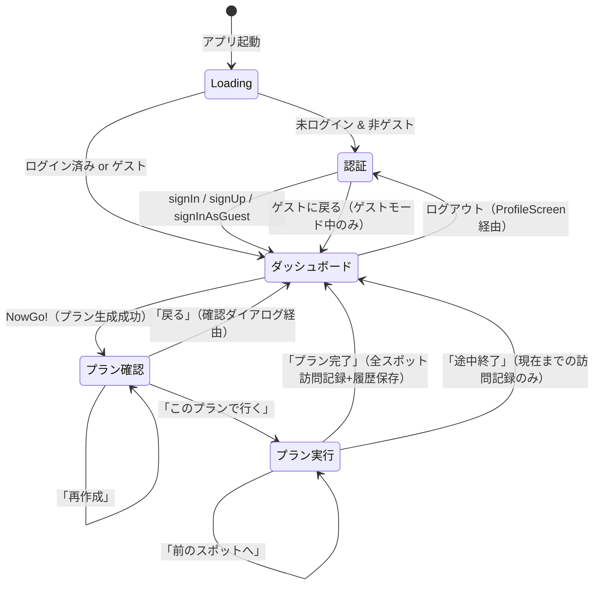
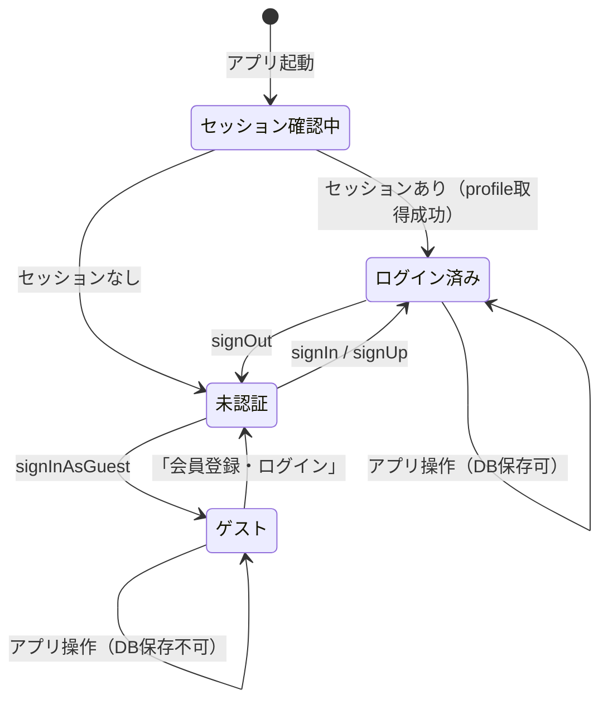
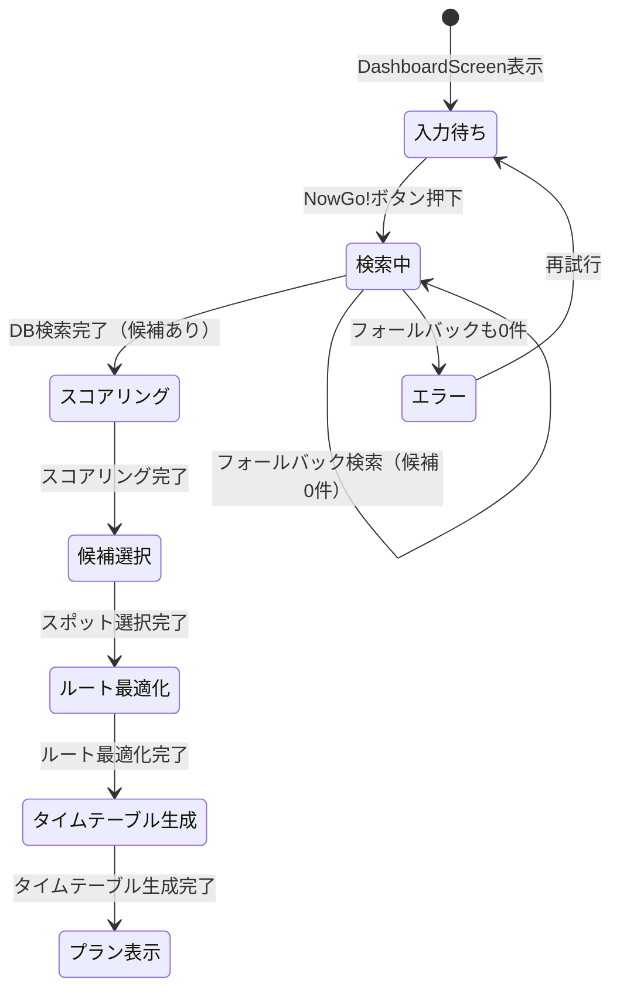
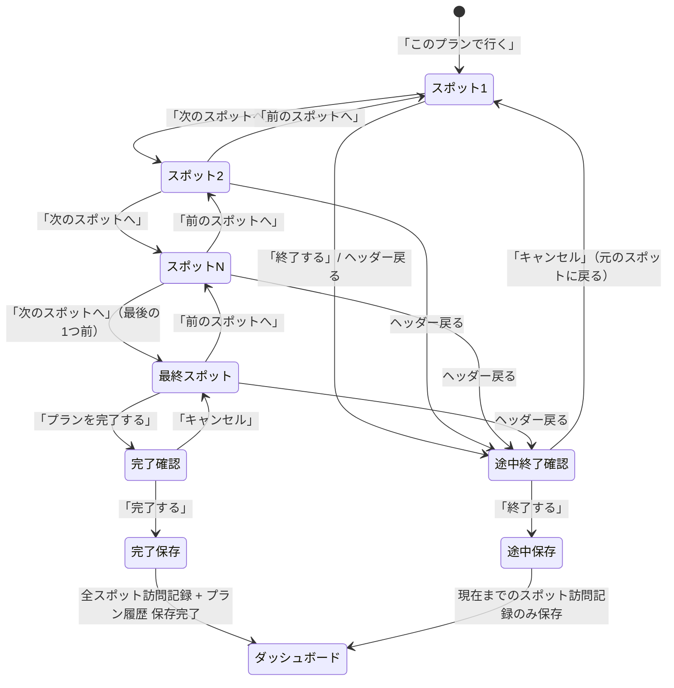
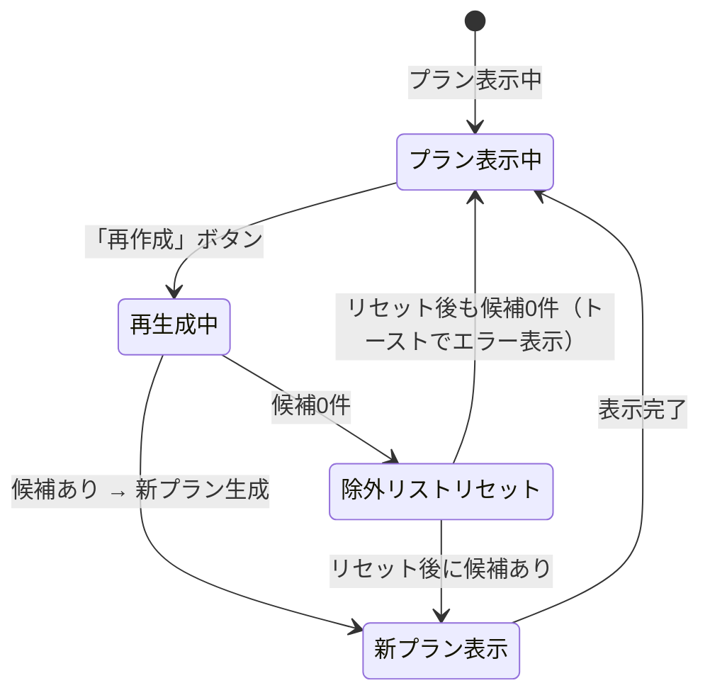
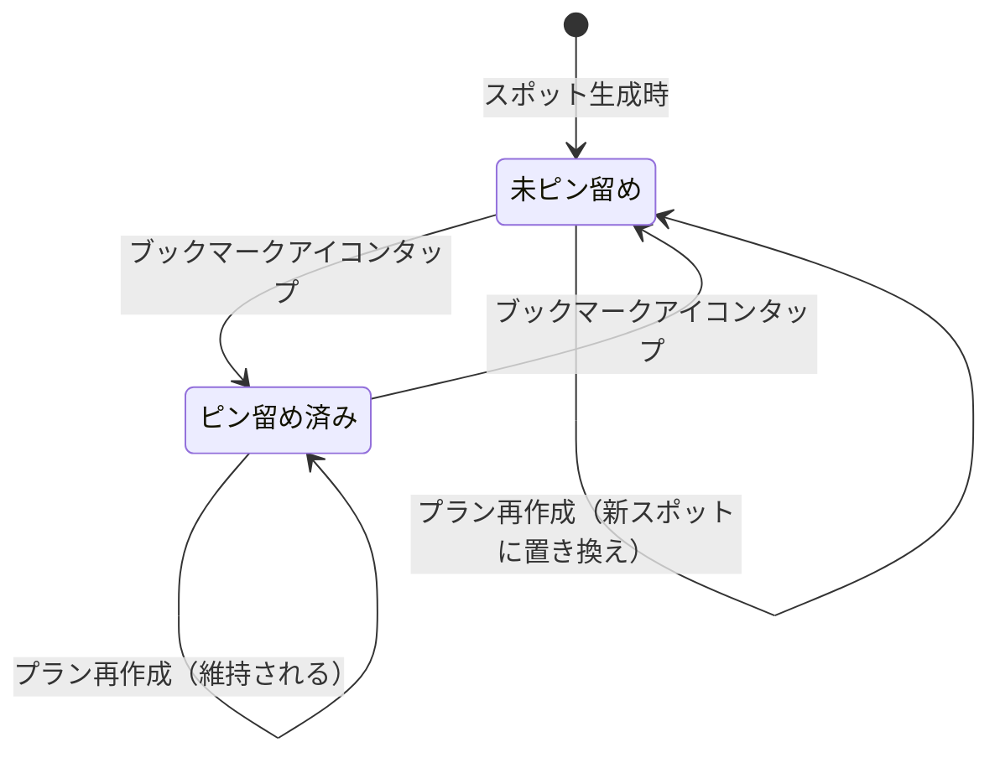
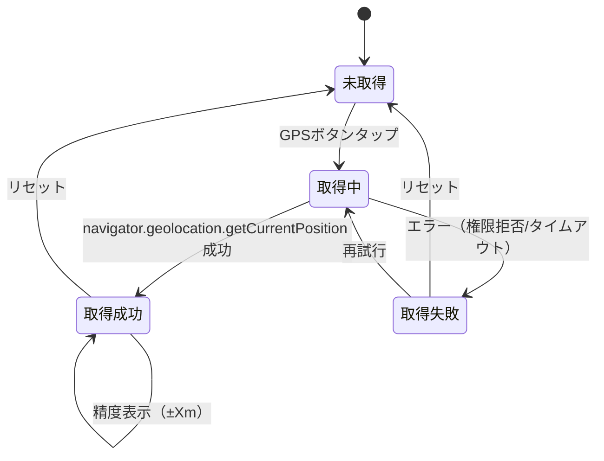

# NowGo 状態遷移図

## 1. アプリケーション全体の状態遷移

Zustandの `currentScreen` で管理される画面状態の遷移。



---

## 2. 認証状態の遷移



### 状態ごとの機能可否

| 機能 | 未認証 | ゲスト | ログイン済み |
|------|--------|--------|-------------|
| プラン生成 | - | OK | OK |
| プラン実行 | - | OK | OK |
| お気に入り保存 | - | - | OK |
| 訪問記録保存 | - | - | OK |
| プラン履歴保存 | - | - | OK |
| 直近の検索駅 | - | localStorage | DB |
| プロフィール編集 | - | - | OK |

---

## 3. プラン生成の状態遷移



---

## 4. プラン実行の状態遷移



### プログレス表示

| 進捗 | ラベル |
|------|--------|
| 0% | スタート！ |
| 1〜33% | スタート！ |
| 34〜66% | 乗ってきた |
| 67〜99% | もうすぐ！ |
| 100% | コンプリート！ |

---

## 5. プラン再作成の状態遷移



### 除外リストの状態

```
初回生成:
  shownSpotIds = [] → プラン生成 → shownSpotIds = [A, B, C]

1回目の再作成:
  excludeSpotIds = [A, B, C] → 新プラン生成 → shownSpotIds = [A, B, C, D, E, F]

2回目の再作成:
  excludeSpotIds = [A, B, C, D, E, F] → 新プラン生成 → shownSpotIds = [A, B, C, D, E, F, G, H, I]

N回目（候補枯渇時）:
  excludeSpotIds = [A, B, ..., X] → 候補0件
  → リセット: excludeSpotIds = [現在のプランのスポットのみ]
  → 再検索 → shownSpotIds = [現在のプランのスポットのみ]
```

---

## 6. ピン留め状態の遷移



### ピン留め時の動作
1. Zustandの `currentPlan.pinnedSpots[]` にIDを追加/削除
2. ログイン時: `toggleFavoriteSpot()` でDB（favorite_spots）にも保存/削除
3. 再作成時: pinnedSpots はそのまま searchSpotsFromDB に渡され、必ずプランに含まれる

---

## 7. GPS取得の状態遷移



### 取得成功時のデータ
```typescript
startLocation = {
  label: "現在地（±{accuracy}m）",
  lat: position.coords.latitude,
  lng: position.coords.longitude,
  source: 'gps',
  accuracy: position.coords.accuracy
}
```
