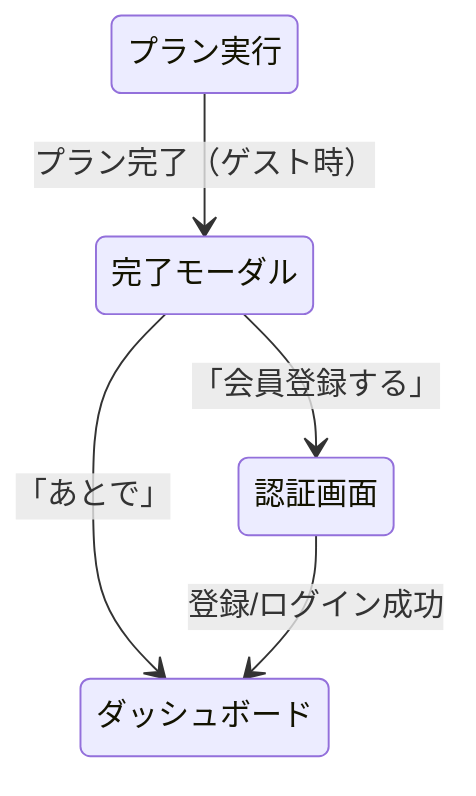

# ゲストユーザーのログイン導線 素案

## 1. 現状の課題

### ログイン導線が弱い
現在、ゲストユーザーがログインに誘導される場面は **ProfileScreen の1箇所のみ**。
プラン作成・実行の主要フローでは一切ログインを促していないため、ゲストのまま使い続けてしまう。

### ゲスト時に「見えるけど機能しない」UI がある
- PlanScreen のブックマーク（お気に入り）ボタンはクリック可能だが、DB保存されない
- プラン完了時の訪問記録・プラン履歴も保存されない
- ユーザーに「保存されていない」ことが伝わらない

---

## 2. ログイン導線の設計方針

### コンセプト
- **邪魔にしない**: メインフロー（プラン作成→実行）は中断させない
- **価値を感じたタイミングで促す**: プラン完了など「保存したい」と思う瞬間に案内
- **段階的に誘導**: 軽いバナー → モーダル → 機能制限の順で強度を上げる

---

## 3. 導線ポイント（全5箇所）

### 3.1 プラン完了時モーダル（最重要）

**タイミング**: ExecutionScreen でプラン完了ボタン押下後

```
┌─────────────────────────────┐
│                             │
│    プランを完了しました！     │
│                             │
│  会員登録すると...           │
│  ・訪問記録が保存されます    │
│  ・プラン履歴を見返せます    │
│  ・お気に入りスポットを管理  │
│                             │
│  [会員登録する]  [あとで]    │
│                             │
└─────────────────────────────┘
```

- 「会員登録する」→ AuthScreen へ（登録後 dashboard に戻る）
- 「あとで」→ そのまま dashboard に戻る
- **表示条件**: ゲストモード && exitMode === 'complete' の場合のみ

### 3.2 お気に入りタップ時のトースト

**タイミング**: PlanScreen でブックマークアイコンをタップした時

```
┌─────────────────────────────────┐
│ お気に入り機能は会員登録で      │
│ 利用できます  [登録する]        │
└─────────────────────────────────┘
```

- Zustand のピン留め（一時的）は引き続き動作する
- DB保存されない旨をトーストで通知
- トースト内の「登録する」リンクで AuthScreen へ
- **初回タップのみ表示**（セッション中1回）

### 3.3 途中終了時の軽い案内

**タイミング**: ExecutionScreen で途中終了確認ダイアログ内

```
現在の確認ダイアログに1行追加:

  プランを途中で終了しますか？
  （2/5箇所訪問済み）
+ ※ゲストモードでは訪問記録は保存されません

  [キャンセル] [終了する]
```

- ダイアログ内にテキスト追記するだけ（非侵襲的）

### 3.4 DashboardScreen の軽いバナー

**タイミング**: ゲストモードでダッシュボード表示時（任意、Nice to Have）

```
┌─────────────────────────────────┐
│ ゲストモードで利用中            │
│ [会員登録で全機能を解放 →]      │
└─────────────────────────────────┘
```

- 画面上部に小さなバナー
- ×ボタンで閉じられる（セッション中は再表示しない）
- **優先度**: 低（他の導線で十分な場合は不要）

### 3.5 ProfileScreen（既存の改善）

**現状**: 「プロフィール機能を利用するには会員登録が必要です」+ ボタン

**改善案**: 会員登録のメリットを具体的に記載

```
┌─────────────────────────────────┐
│  ゲストモードで利用中            │
│                                 │
│  会員登録（無料）で使える機能:   │
│  ✓ お気に入りスポットの保存     │
│  ✓ 訪問したスポットの記録       │
│  ✓ プラン履歴の閲覧            │
│  ✓ 検索条件の自動保存           │
│                                 │
│  [会員登録・ログイン]            │
│  [ホームに戻る]                  │
└─────────────────────────────────┘
```

---

## 4. 実装優先度

| # | 導線 | 優先度 | 工数 | 効果 |
|---|------|--------|------|------|
| 1 | プラン完了時モーダル | 高 | 中 | 最も自然なタイミングで訴求 |
| 2 | お気に入りタップ時トースト | 高 | 小 | 機能制限を正直に伝える |
| 3 | 途中終了時テキスト追記 | 中 | 小 | 非侵襲的な情報提供 |
| 4 | ProfileScreen 改善 | 中 | 小 | 既存UIの改善 |
| 5 | Dashboard バナー | 低 | 小 | Nice to Have |

---

## 5. 画面遷移への影響



---

## 6. 技術メモ

- ゲスト判定: `useAuth()` の `isGuest` フラグ
- トースト表示: 既存の `use-toast.ts` を利用
- セッション内の表示制御: `useRef` or `sessionStorage` で管理
- AuthScreen からの復帰: 登録成功後に `setScreen('dashboard')` で戻る（既存動作）
